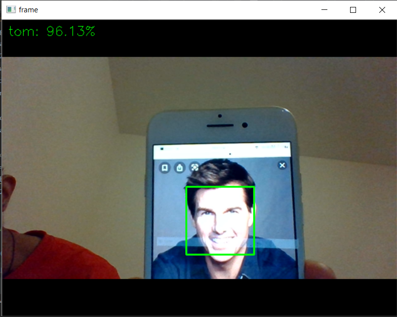
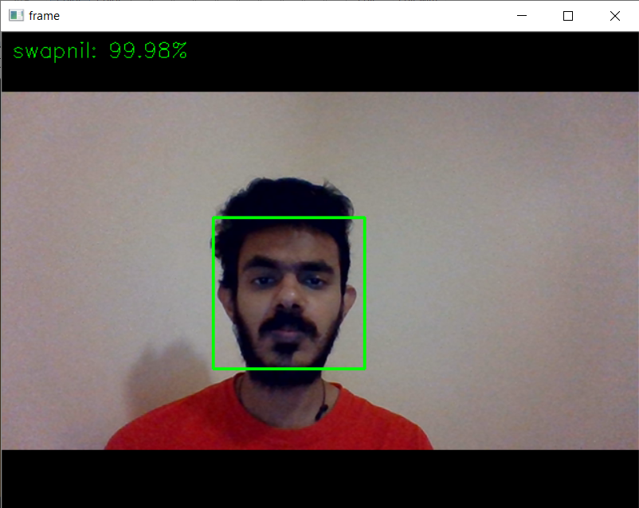
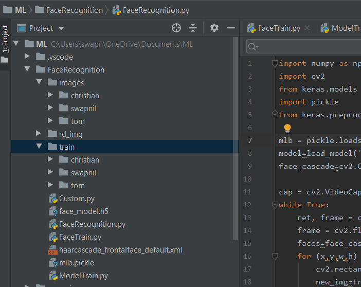

# Real-time-Face-Recognition
Real time Face Recognition using OpenCV and Keras

 

## Getting Started
Clone or download the project to your system

<h4>Prequisites</h4>

Python
<pre>Install Python 3 or Anaconda</pre>

<h4>Installing</h4>

Install Dependencies
<pre>pip install -r requirements.txt</pre>
 
<h4>File Strucure</h4>

<h4>Running</h4>

FaceTrain.py
<pre>Add subfolders with label as folder names in images folder. Add images to train and test in this subfolders</pre>

Custom.py
<pre>Captures training images in real time and stores in FOLDER_NAME, Change FOLDER_NAME to label</pre>

ModelTrain.py
<pre>Trains the model using Keras VGG16</pre>

FaceRecognition.py
<pre>A frontend video frame which recognizes faces in real time</pre>
